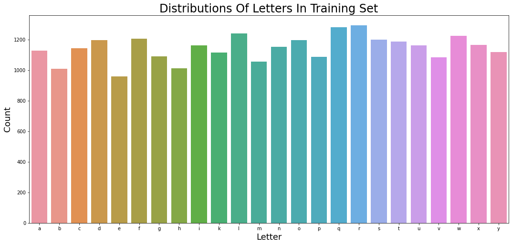
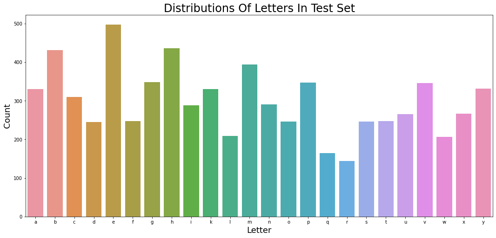
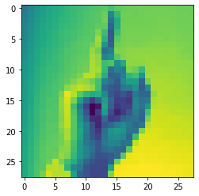
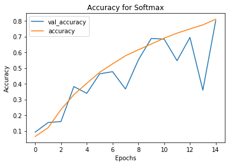
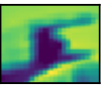
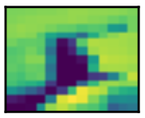
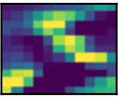
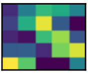
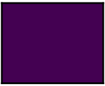
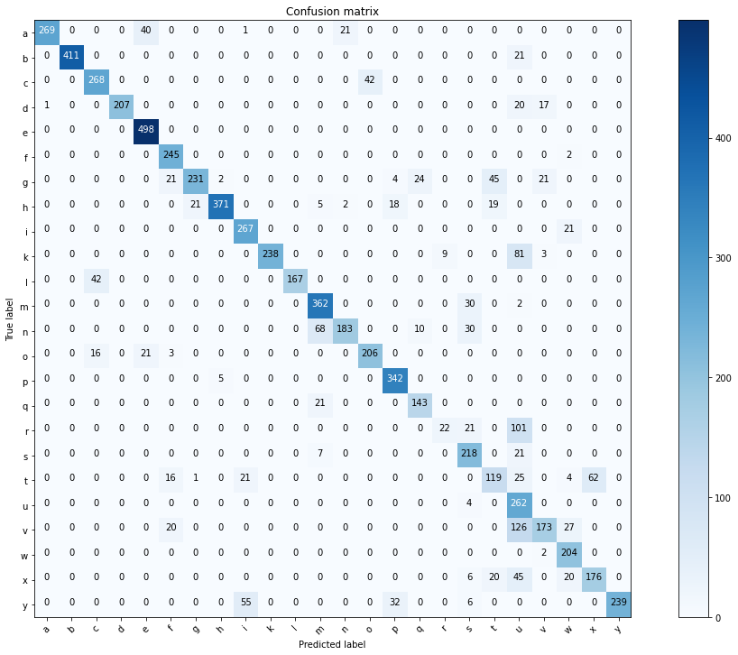

# Image Classification -- American Sign Language

## Outline

- Dataset Introduction

- EDA

- Model

- CNN

- Insights

- Further Exploration

## Project Goal

The goal of this project is to correctly predict a letter from the American Sign Language alphabet from an image of a hand gesture. This includes all letters expect for 'J' and 'Z' becasue those signs require movement. 

## Data Collection

The data was collected from Kaggle, originally uploaded by Kaggle account tecperson 2018 (https://www.kaggle.com/datamunge/sign-language-mnist). The data is in CSV files and each row represents one image and each colomn represents the grey scale for a single pixel of that image. Turning each row into a matrix we can generate images size 28X28. The files are already split into training and test sets. The training set contains 27455 images and the testing set has 7172 images. 

## EDA

The graphic below shows distributions of letters in the training set.

The graphic below shows distributions of letters in the test set.

The graphic below is an example image transfered from training set csv.

## Data Prepping

- Create labels for both training set and testing set.

- Turn both training set and testing set into matrix(reshape), flatten, and standardize(divide by 255).

- Split the training set into training set and validating set.

- Set number of classes to 25 (26 letters - 2(no J,Z) +1(label))

- Trun train_label, validate_label into single row matrixes.

## MLP

### Sigmoid

- Test set Accuracy: 0.29, Epochs = 15

### Softmax

- Test set Accuracy: 0.59, Epochs = 15

### Hypertuned Softmax

- Test set Accuracy: 0.63, Epochs = 15

## CNN 2D

- Adopt 3 different layers of convolution 2D and Maxpooling 2D

- Dropout 10% of observations

- Save model for future usage

- Test set accuracy: 0.81, Epochs: 18

## Extracting Feature Map

- Extract model layer outputs

- Create a model for displaying the feature maps

- Extract Layer Names for Labelling

- Post-process the feature to make it visually palatable
 
 The graphics below show the transformation of Conv2D --> Max Pooling2D for each 3 layers.
 
 - Layer 1:
 
 
 
 
 - Layer 2:
 
 
 
 
 - Layer 3:
 
 
 
 
 ## Confusion Matrix
 
 - Create a 24X24 confusion matrix for each letter.
 
 - Calculate False Nagative error % to get top letters most misclassified to other letters.
 
 - Calculate False Positive error % to get top letters most misclassified by other letters.
 
 The graphic below shows the confusion matrix.
 
 
 ## Insightful Analysis
 
 - 'R', 'T', and 'V' were the most miss predicted
 - Other signs were incorrectly predicted as 'U' and 'T' most often
 
 
 ## Further Exploration
 
- Use larger pictures 

- Adopt heat maps to show activation features on an image

- Implement pre-trained data to increase our accuracy

- Involve data augmentation to see if we can increase our accuracy

 ## Powerpoint Link
 
 - https://docs.google.com/presentation/d/1g4U47n2K-JUqWbb6WHiNGrnX8CKCCoSTPpEsJ8coptc/edit?usp=sharing
