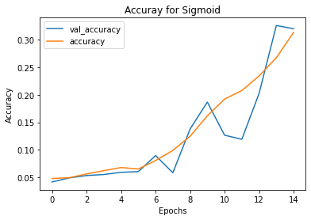
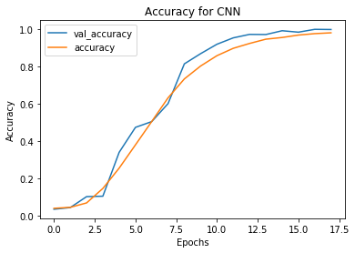

# Chocolate-lab

## Outline

- Dataset Introduction

- EDA

- Model

- CNN

- Insights

- Further Exploration

## Project Goal

The goal for this project is to categorize giving American sign languages correctly to their matching English letters.

## Data Collection

The data was collected from Kaggle, originally uploaded by Kaggle account tecperson 2018. The data is composed by training csv with shape (27455, 785) and testing csv with shape (7172, 785). All are pixel values that gerenate 28x28 images.

## EDA

The graphic below shows distributions of letters in training set.

The graphic below shows distributions of letters in test set.

The graphic below is an example image transfered from training set csv.

## Data Prepping

- Create labels for both training set and testing set.

- Turn both training set and testing set into matrix(reshape), flatten, and standardize(devide by 255).

- Train validate split for training set.

- Set number of classes to 25 (26 letters - 2(no J,Z) +1(label))

- Trun train_label, validate_label into single row matrixes.

## MLP

### Sigmoid

- Test set accuracy: 0.29, Epochs = 15

### Softmax

- Test set accuracy: 0.59, Epochs = 15

### Hypertuned Softmax

- Test set accuracy: 0.63, Epochs = 15

## CNN 2D

- Adopt 3 layer convolution 2D and Maxpooling 2D

- Dropout 10% of observations

- Save model for future usage

- Test set accuracy: 0.81, Epochs = 18

## Extracting Feature Map

- Extract model layer outputs

- Create a model for displaying the feature maps

- Extract Layer Names for Labelling

- Post-process the feature to make it visually palatable
 
 The graphics below show the transformation of Conv2D --> Max Pooling2D for each 3 layers.
 
 
 
 
 
 
 
 
 
 
 ## Confusion Matrix
 
 - Create a 24X24 confusion matrix for each letter.
 
 - Calculate False Nagative error % to get top letters most misclassified to other letters.
 
 - Calculate False Positive error % to get top letters most misclassified by other letters.
 
 The graphic below shows the confusion matrix.
 
 
 ## Further Exploration
 
- Try larger picture size data

- Try heat map to show activation features

- Try to implement pre-trained data

- Try to involve data augmentation

